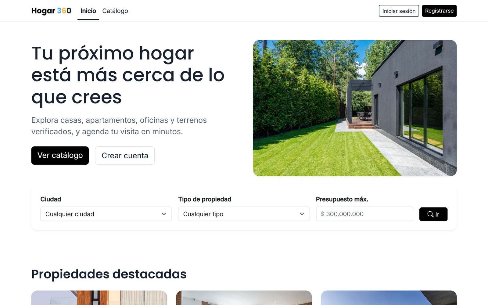
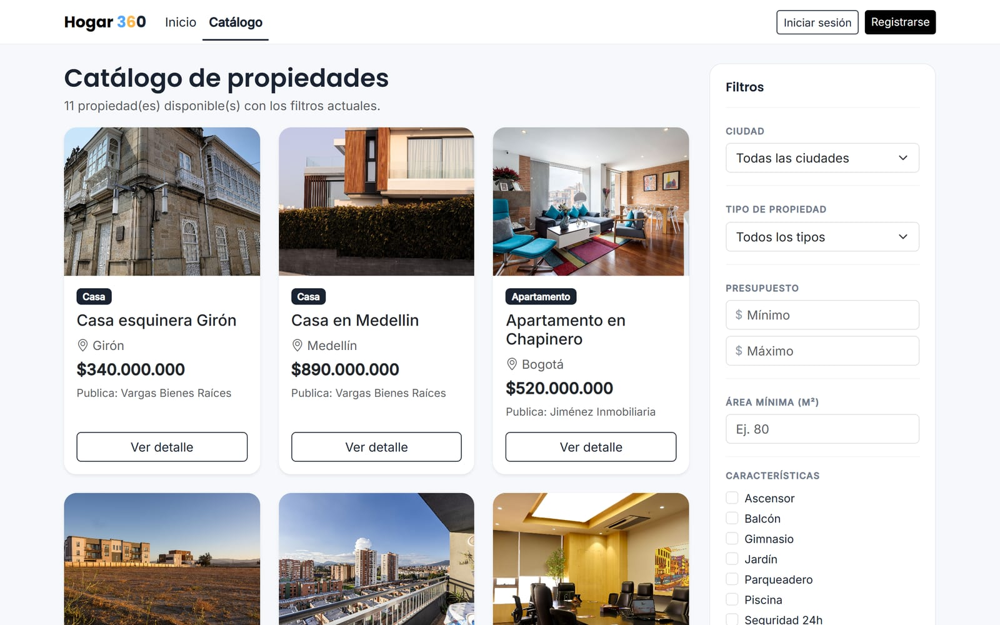
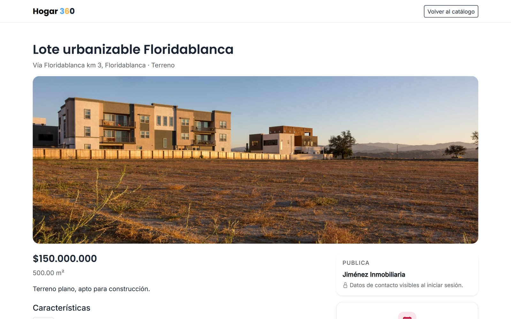
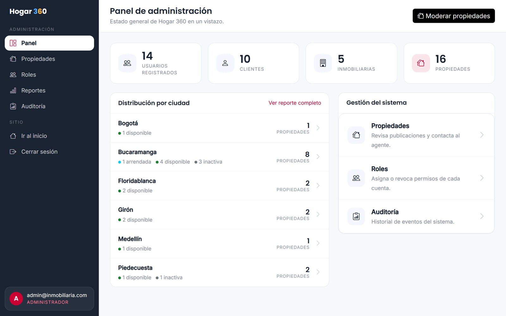
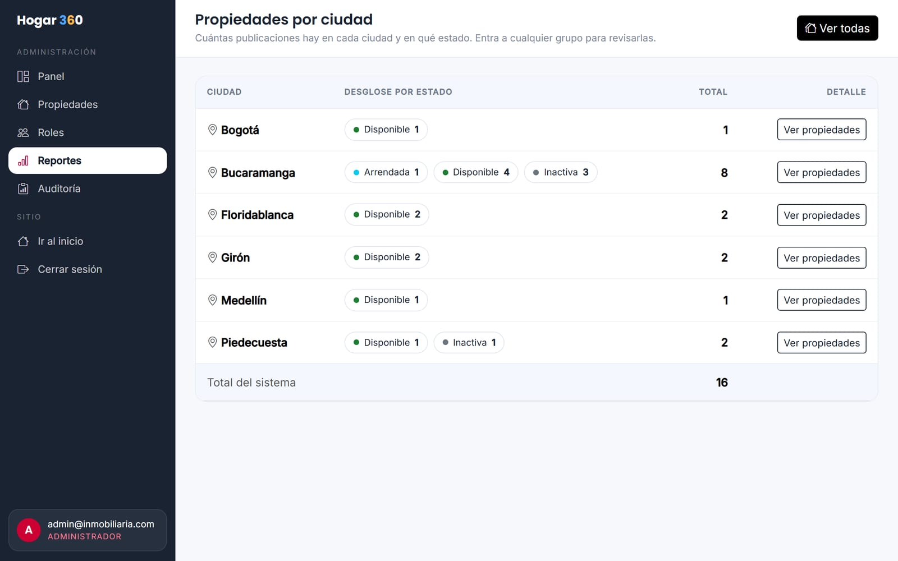

# Hogar 360: sistema web para inmobiliaria

Aplicación web para publicar, buscar y gestionar propiedades en venta o arriendo, con paneles distintos para clientes, inmobiliarias y administradores. Proyecto académico de la materia Programación Java (Unidades Tecnológicas de Santander), desarrollado con Scrum en 3 sprints.

<p align="center">
  
  
</p>
<p align="center">
  
  
</p>
<p align="center">
  
  
</p>

<p align="center"><sub>Capturas con los datos de prueba del script DML.</sub></p>

## Qué hace

- **Página de inicio** con propiedades destacadas y buscador rápido por ciudad, tipo y presupuesto.
- **Catálogo** con filtros por ciudad, tipo, rango de precio, área mínima y características (ascensor, piscina, parqueadero…), orden configurable y paginación.
- **Ficha de cada propiedad** con galería de fotos, características y datos de la inmobiliaria (el contacto solo se ve con sesión iniciada).
- **Registro e inicio de sesión** con correo único y redirección al panel de cada rol.
- **Cliente**: favoritos, citas para visitar una propiedad y solicitudes de compra o arriendo, con la respuesta del agente.
- **Inmobiliaria**: publica y edita sus propiedades (la matrícula se genera sola), atiende citas y solicitudes con un contador de pendientes y mantiene su ficha comercial.
- **Administrador**: asigna y revoca roles, activa o desactiva cuentas, modera las publicaciones, revisa la auditoría y el reporte de propiedades por ciudad y estado.
- **Auditoría** de las acciones importantes (cambios de rol, citas, solicitudes, bajas de propiedades).

## Decisiones técnicas

- **MVC con Servlets y JSP**: los controladores (`@WebServlet`) preparan los datos y las JSP (con JSTL) solo los muestran. El acceso a datos va en clases DAO, una por tabla.
- **Control de acceso en el servidor**: un filtro (`AccesoFilter`) revisa el rol en cada petición a `/cliente/*`, `/agente/*` y `/admin/*`. Ocultar botones en la vista no basta.
- **Contraseñas con BCrypt** (12 rondas). Nunca se guardan en texto plano.
- **Consultas parametrizadas** (`PreparedStatement`) en todos los DAO. El orden del catálogo sale de una lista cerrada de opciones, nunca de texto escrito por el usuario, para evitar inyección SQL en el `ORDER BY`.
- **Post-Redirect-Get** con mensajes flash: recargar la página no reenvía un formulario ni repite una acción.
- **Separación de privilegios**: un administrador no puede desactivarse a sí mismo, no puede tocar la cuenta de otro administrador y el sistema no deja quitar el rol al último administrador activo.
- **Base de datos en tercera forma normal** (16 tablas), con relaciones 1:1 (usuario y perfil), 1:N y N:M (propiedades y características).

## Stack

| Parte | Herramienta |
|---|---|
| Lenguaje | Java 17 |
| Web | Servlets y JSP (Java EE 8), JSTL 1.2 |
| Servidor | Apache Tomcat 9 |
| Base de datos | PostgreSQL, JDBC |
| Seguridad | jBCrypt |
| Pruebas | JUnit 4 |
| Interfaz | Bootstrap, CSS y JavaScript propios |
| Entorno | NetBeans (proyecto Ant) |

## Estructura

```
src/java/com/inmobiliaria/
  controlador/  servlets: una clase por pantalla o acción
  dao/          acceso a datos con JDBC
  modelo/       clases del dominio (Propiedad, Cita, Solicitud…)
  filtro/       control de acceso, codificación y contadores del menú
  excepcion/    errores del negocio (correo o matrícula repetidos, horario ocupado)
  util/         conexión a la base de datos, mensajes flash y paginación
web/            páginas JSP por rol (cliente/, agente/, admin/), CSS, JS e imágenes
test/           pruebas de los DAO
docs/
  database/     scripts DDL y DML, migración y consultas SQL documentadas
  modelo-datos/ modelo entidad-relación y diccionario de datos
  scrum/        planning, review y retrospectiva de cada sprint
```

## Cómo ejecutarlo

Requisitos: JDK 17, Apache Tomcat 9, PostgreSQL y NetBeans (o Ant).

1. Crea la base de datos `inmobiliaria_db` y ejecuta, en orden, `docs/database/ddl-inmobiliaria.sql` y `docs/database/dml-inmobiliaria.sql`.
2. Copia `src/java/db.example.properties` como `src/java/db.properties` y pon tu usuario y contraseña de PostgreSQL. Ese archivo no se sube al repositorio.
3. Abre el proyecto en NetBeans, configura Tomcat 9 como servidor y dale **Run**. La aplicación queda en `http://localhost:8080/InmobiliariaWebApp/`.

Los usuarios de prueba y su contraseña están al comienzo de `docs/database/dml-inmobiliaria.sql`.

## Documentación

- [Modelo entidad-relación](docs/modelo-datos/MER-inmobiliaria.png) y [diccionario de datos](docs/modelo-datos/diccionario-datos.md).
- [Consultas SQL documentadas](docs/database/consultas-sql.md): joins de varias tablas, relación muchos a muchos, `LEFT JOIN` y agregación con `GROUP BY`/`HAVING`.
- [Sprints](docs/scrum/): planning, review y retrospectiva de cada uno, y las [mejoras posteriores](docs/scrum/post-sprint3-mejoras.md).

## Autor

José Francisco Martínez Aguilar.
